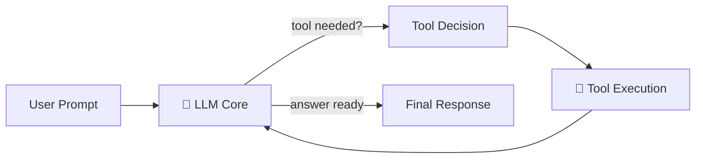
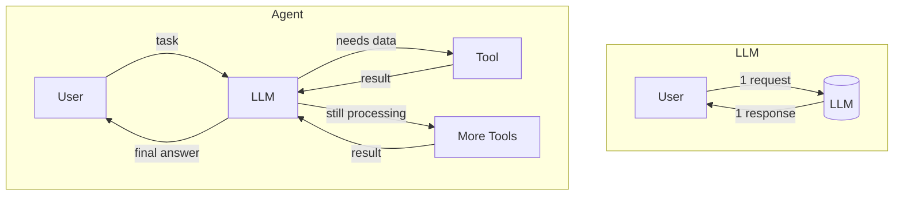
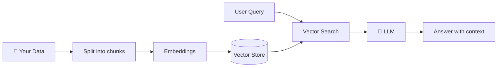
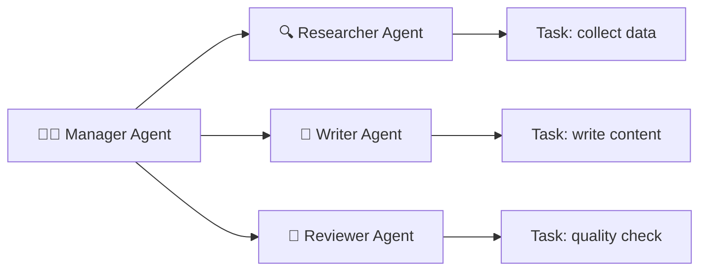
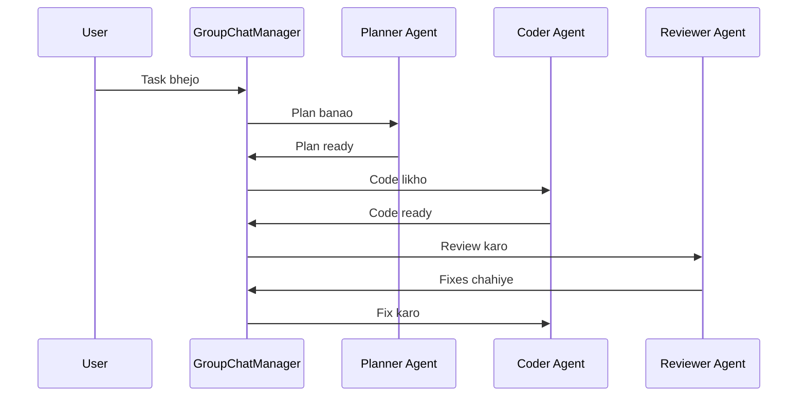
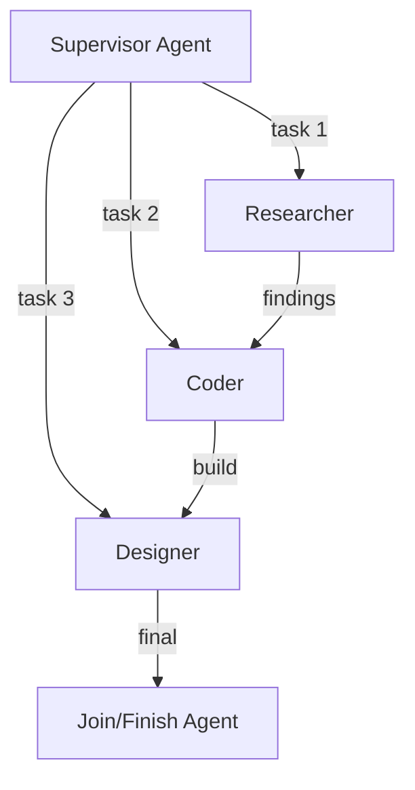
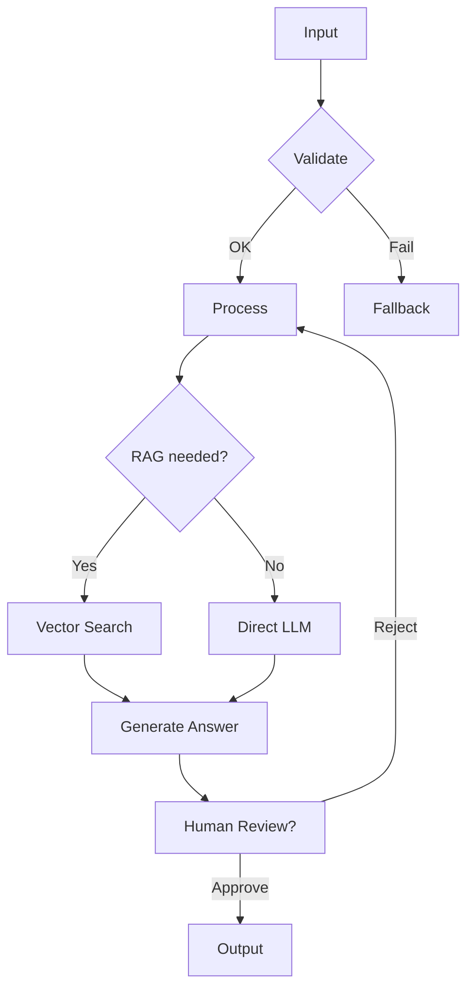
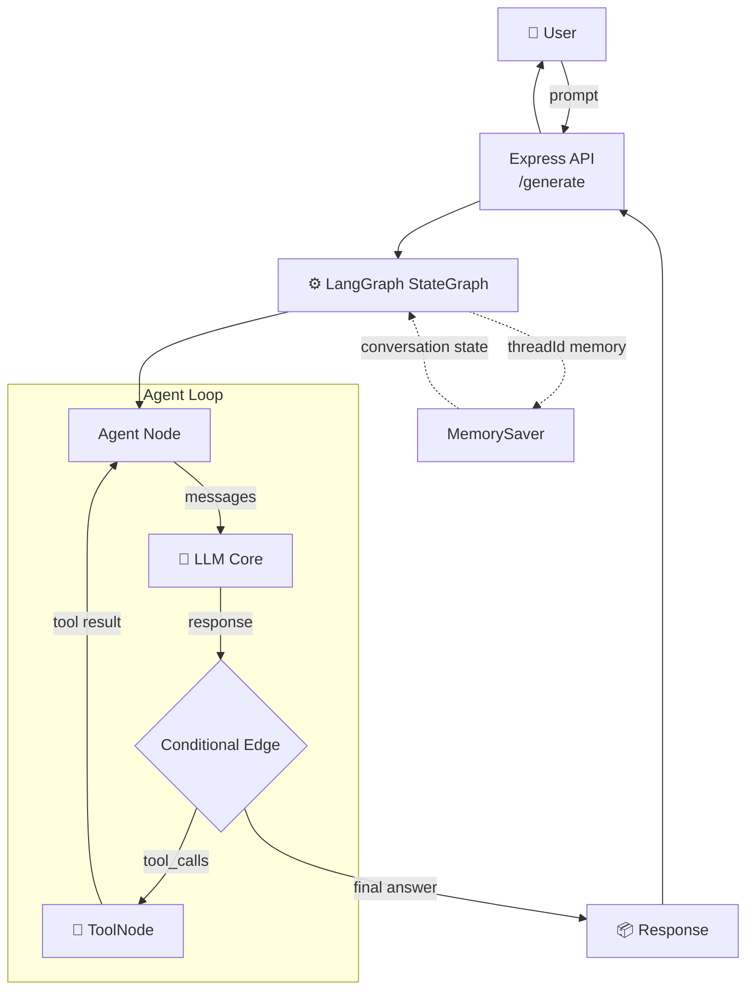

# 🤖 AI Agents + LangGraph + LangChain — Learning Repo

> **"Agents sirf LLM nahi hote — wo LLM + Tools + Memory + Decision-Making ka combo hote hain."**

Yeh meri AI learning repository hai jahan main Gen AI, LLMs, AI Agents, aur top frameworks (**LangGraph, LangChain, LlamaIndex, CrewAI, AutoGen**) ko hands-on explore kar raha hoon. Har topic ko **code + diagram + real-life usage** ke saath samjha hai taaki theory sirf padhne ke liye na rahe, balki implementation bhi ho.

---

## 📑 Table of Contents

1. [Gen AI — Generative AI Kya Hai?](#1-gen-ai--generative-ai-kya-hai)
2. [LLMs — Large Language Models](#2-llms--large-language-models)
3. [AI Agents — Smart Automation](#3-ai-agents--smart-automation)
4. [LLM vs AI Agents — Difference](#4-llm-vs-ai-agents--difference)
5. [LangChain — The Foundation Framework](#5-langchain--the-foundation-framework)
6. [LangGraph — Graph-Based Agents](#6-langgraph--graph-based-agents)
7. [LlamaIndex — Data & RAG Maestro](#7-llamaindex--data--rag-maestro)
8. [CrewAI — Team of Agents](#8-crewai--team-of-agents)
9. [AutoGen — Multi-Agent Conversations](#9-autogen--multi-agent-conversations)
10. [Stateful AI Agents & Memory](#10-stateful-ai-agents--memory)
11. [Multi-Agent Systems](#11-multi-agent-systems)
12. [Workflow Orchestration](#12-workflow-orchestration)
13. [Tools — Agent Ki Superpower](#13-tools--agent-ki-superpower)
14. [Diagram Explanations](#14-diagram-explanations)
15. [Real-Life Usages](#15-real-life-usages)
16. [Project Setup — Hands-On Code](#16-project-setup--hands-on-code)
17. [File Structure](#17-file-structure)
18. [Roadmap / Next Steps](#18-roadmap--next-steps)

---

## 1. Gen AI — Generative AI Kya Hai?

**Gen AI** (Generative AI) wo AI hai jo **naya content generate** karta hai — text, image, audio, video, code. Ye sirf data analyze nahi karta, balki us data se **kuch naya banata hai**.

### 🔬 Deep Knowledge

- **Core Idea:** Probability-based prediction — model dekhta hai ki sequence me agla kya aana chahiye.
- **Types:**
  - *Text* → ChatGPT, Gemini, Claude
  - *Image* → DALL-E, Midjourney, Stable Diffusion
  - *Audio* → ElevenLabs, Whisper
  - *Code* → GitHub Copilot
- **Underlying Tech:** Transformers, RNN → Attention Mechanism → **Transformer Architecture** (2017 breakthrough).

### 💻 Code Snippet — Basic Gen AI Call

Siray ka SDK use karke (iss repo me `@google/genai` use kiya hai):

```js
import { GoogleGenAI } from "@google/genai";

const genAI = new GoogleGenAI({
    apiKey: process.env.GOOGLE_API_KEY,
});

const interaction = async () => {
  const response = await genAI.models.generateContent({
    model: "gemini-2.0-flash",
    contents: [{
      role: "user",
      parts: [{
        text: "Write a story about a magic backpack."
      }]
    }]
  });
  console.log(response.text);
}

interaction();
```

> 💡 **Key Point:** Direct API call se model se baat karte ho, lekin koi *state*, *tools*, ya *multi-step logic* nahi hai — bas ek single request-response.

---

## 2. LLMs — Large Language Models

**LLM** ek **neural network** hai jo bahut bade corpus (internet text) par train kiya gaya hai. Naam me hi hai — **Large** (arbn-plai: billions of parameters).

### 🔬 Deep Knowledge

- **Parameters:** GPT-4 (~1.8T), Gemini, Llama-3.1 (405B) — parameters hi model ki "memory of knowledge" hote hain.
- **Training Kaise hota hai?**
  1. *Pre-training:* Internet data par next-word prediction
  2. *Fine-tuning:* Specific data par aur behtar banana
  3. *RLHF:* Human feedback se alignment (helpful/harmless)
- **Tokenizer:** Text ko tokens me todta hai. `"Hello"` ≈ 1 token, `"Hindustan"` ≈ 2-3 tokens.
- **Context Window:** Model ek baar me kitna text "yaad" rakh sakta hai (Gemini 1M tokens, Claude 200K).
- **LLMs apne kuch limitations bhi rakhte hain** ↓

| Limitation | Example | Solution |
|---|---|---|
| Hallucination | Galat fact confidently batana | RAG / Search tools |
| No real-time data | October 2024 ke baad ka nahi pata | Tavily / Web search tool |
| No memory across sessions | Aaj ki baat kal nahi yaad | MemorySaver / State |
| No action-taking | Khud flight book nahi kar sakta | Function calling / Tools |

### 💻 Code Snippet — LangChain se LLM Call

```js
import { ChatGroq } from "@langchain/groq";

const llm = new ChatGroq({
    model: "openai/gpt-oss-120b",
    apiKey: process.env.GROQ_API_KEY,
    temperature: 0.7,        // creativity control (0 = deterministic, 1 = creative)
    maxTokens: 2080,
    maxRetries: 2,           // retry on failure
});
```

> 💡 **Temperature:** Low (0-0.3) = factual/consistent answers. High (0.7-1) = creative/random answers.

---

## 3. AI Agents — Smart Automation

**AI Agent** ek LLM-based system hai jo sirf reply nahi deta — wo **decisions leta hai, tools use karta hai, aur multi-step tasks complete karta hai**. Ek agent ko hum ek "employee" ke roop me soch sakte hain jo:

1. Task **samajhta** hai
2. Decide karta hai ki kya karna hai
3. Tool call karta hai (search, API, database)
4. Result ko process karke **final answer** deta hai

### 🔬 Agent ka Anatomy



### 🛠️ Agent ka Core Loop (ReAct Pattern)

1. **Reason** — LLM sochta hai: "Iska jawab dene ke liye mujhe live data chahiye"
2. **Act** — Tool call karta hai (e.g., `TavilySearch`)
3. **Observe** — Tool ka result aata hai
4. **Repeat** — Jab tak final answer ready nahi hota

### 💻 Code Snippet — Agent ka basic recipe

```js
import { TavilySearch } from "@langchain/tavily";
import { ToolNode } from "@langchain/langgraph/prebuilt";

// Step 1: Tool banao
const tool = new TavilySearch({
  apiKey: process.env.TAVILY_API_KEY,
  maxResults: 5,
  topic: "general"
});

const tools = [tool];

// Step 2: Tool ko LLM se "bind" karo (model ko pata chalega ki tool exist karta hai)
const llm = new ChatGroq({ /* config */ }).bindTools(tools);

// Step 3: ToolNode — jo actual tool execute karta hai
const toolNode = new ToolNode(tools);
```

> 💡 **Key Point:** `bindTools()` LLM ko batata hai ki **kaunse tools available hain** aur uski schema kya hai — tabhi model tool call karne ka decide kar sakta hai.

---

## 4. LLM vs AI Agents — Difference

Yeh sabse common confusion hai. Dono me kya farak hai?

| Feature | 🗣️ LLM | 🤖 AI Agent |
|---|---|---|
| **Nature** | Single text prediction | Multi-step task executor |
| **Tools** | Nahi use kar sakta | Tools ko call karta hai |
| **Memory** | Sirf context window | Persistent state (threads) |
| **Decision Making** | Ek baar ka output | Loop me choices leta hai |
| **Sends request** | Ek request → ek answer | Multiple cycles (Reason→Act→Observe) |
| **Example** | "What is 5G?" ka jawab | "5G plans compare karke mujhe best batao" search karke |
| **Predictable?** | Quite deterministic | Less predictable (llm decide karta hai) |



> 🔥 **Ek Line me:** **LLM = Dimagg**, **Agent = Dimag + Haath (tools) + Memory + Autonomy**. LLM agent ka *brain* hai.

---

## 5. LangChain — The Foundation Framework

**LangChain** ek open-source framework hai jo LLM applications banane ke liye building blocks deta hai. Isko "AI development ka Express.js" samajh lo — jo cheezein manually karni padti, wo ready-made components deta hai.

### 🔬 LangChain ke Core Components

| Component | Kaam |
|---|---|
| **Models** | `ChatGroq`, `ChatGoogleGenerativeAI` — LLM wrappers |
| **Messages** | `SystemMessage`, `HumanMessage`, `AIMessage` |
| **Tools** | Web search, API callers, calculators |
| **Chains** | LLM + prompt + output parsing ka pipeline |
| **Memory** | Conversation history ka management |
| **Retrievers** | RAG ke liye document search |
| **Output Parsers** | Model ke raw output ko structured banana |

### 💻 Code Snippet — LangChain Messages + Chat

```js
import { SystemMessage } from "@langchain/core/messages";
import { ChatGoogleGenerativeAI } from "@langchain/google-genai";

const llm = new ChatGoogleGenerativeAI({
    model: "gemini-2.0-flash",
    apiKey: process.env.GOOGLE_API_KEY
});

const response = await llm.invoke([
    { role: "system", content: "You are a helpful assistant that always answers in Hinglish." },
    { role: "user", content: "Mujhe Node.js batao" }
]);

console.log(response.content);
```

> 💡 **System vs User message:** System message model ki **persona/instructions** set karta hai; user message actual query hota hai.

---

## 6. LangGraph — Graph-Based Agents

**LangGraph** LangChain ka **advanced layer** hai jo agents ko **graph** ke roop me model karta hai. Ye recursive loop ko control karne ke liye bana hai — **StateGraph** ke through nodes (steps) aur edges (transitions) define karte ho.

> 🎯 **LangChain vs LangGraph:** LangChain = LLM apps banane ke tools. LangGraph = **complex, stateful, controllable agent workflows** banane ke liye.

### 🔬 Core Concepts

1. **State** — Data jo har node me flow hota hai (e.g., messages, prompts)
2. **Node** — Ek step/function jo state par kaam karta hai
3. **Edge** — Node A se Node B ka connection
4. **Conditional Edge** — Condition ke hisaab se decide karta hai kaunsa node chalega
5. **Checkpointer** — State ko saath me store karta hai (memory ke liye)

```mermaid
graph TD
    START --> A[🧠 Agent Node<br/>LLM decide karta hai]
    A --> C{Conditional Edge<br/>Tool call?}
    C -->|Yes → "tools"| T[🔧 Tools Node<br/>Search etc.]
    T --> A
    C -->|No → END| E[✅ Final Answer]
```

### 💻 Code Snippet — Aapke Repo ka Real LangGraph Code

```js
import { StateGraph, END, START, MessagesAnnotation, MemorySaver } from "@langchain/langgraph";
import { ToolNode } from "@langchain/langgraph/prebuilt";

// Step 1: Agent node — LLM ko messages bhejta hai
const callLLM = async (state) => {
  const response = await llm.invoke([
    { role: "system", content: "You are a helpful assistant with access to a search tool..." },
    ...state.messages
  ]);
  return { messages: [response] };
}

// Step 2: Conditional edge — tool call hua ya nahi?
const shouldContinue = async (state) => {
  const lastMessage = state.messages[state.messages.length - 1];
  if (lastMessage.tool_calls && lastMessage.tool_calls.length > 0) {
    return "tools";          // tool call karo
  }
  return END;                 // answer ready hai
}

// Step 3: Graph banana + compile karna
const graph = new StateGraph(MessagesAnnotation)
  .addNode("agent", callLLM)
  .addNode("tools", toolNode)
  .addEdge(START, "agent")
  .addEdge("tools", "agent")              // tools ke baad wapas agent ke paas
  .addConditionalEdges("agent", shouldContinue)
  .compile({ checkPointer: new MemorySaver() });

// Step 4: Graph ko invoke karna
const response = await graph.invoke(
  { messages: [{ role: "user", content: prompt }] },
  { configurable: { threadId: "user1" } }   // stateful memory ke liye
);

res.status(200).json({ response: response.messages[response.messages.length - 1].content });
```

### 🔄 Flow Breakdown (jo aapke code me hota hai)

1. **User** prompt deta hai → graph me `messages` banate hain
2. **START** → `agent` node
3. **Agent node** LLM ko call karta hai (system + user messages)
4. **Conditional Edge** check karta hai:
   - Agar LLM ne **tool_calls** bheje → `tools` node
   - **Tools node** search karta hai → result wapas agent ko
5. Loop tab tak chalta hai jab tak LLM tool call band na kar de
6. **END** — final answer user ko milta hai

---

## 7. LlamaIndex — Data & RAG Maestro

**LlamaIndex** (formerly GPT Index) **data frameworks** hai — iska asli power **RAG (Retrieval Augmented Generation)** me hai. Jahan LangChain agents/chat me strong hai, wahan LlamaIndex **your own data** ko LLM ke saath jodne me zabardast hai.

### 🔬 Deep Knowledge

LlamaIndex ka kaam 4 steps me hota hai:

1. **Ingestion (Load)** — Data load karo (PDF, CSV, DB, Web)
2. **Indexing (Split + Embed)** — Documents ko chunks me todo, embeddings banao
3. **Querying (Retrieve + Generate)** — User query par relevant chunks dhundho, LLM ko do
4. **Response** — Garbage-In-Garbage-Out nahi, sirf relevant data ka answer



> 🎯 **Use Case:** Apni company ke 100 PDF documents ka chatbot banao jo sirf aapke data se answer de (hallucination kam).

---

## 8. CrewAI — Team of Agents

**CrewAI** me agents ko ek **team (crew)** ke roop me organize karte ho — jaise ek company me roles hote hain. Har agent ki **role, goal, aur backstory** hoti hai.

### 🔬 Deep Knowledge

- **Crew** = Plan hai jisme multiple agents ek task chain me kaam karte hain
- **Role-based:** Researcher, Writer, Critic, Analyst...
- **Task delegation:** Ek agent dusre agent ko kaam de sakta hai
- **Sequential & Hierarchical processes**



> 🎯 **Use Case:** Ek research report agent — researcher internet se data dhunde, writer report likhe, reviewer usko polish kare. Sab automatic.

---

## 9. AutoGen — Multi-Agent Conversations

**AutoGen** (Microsoft ka framework) **conversation-based multi-agent** systems banata hai. Yahan agents aapas me **baat karke** (converse karke) task solve karte hain.

### 🔬 Deep Knowledge

- **Conversable Agents** — Agents jo messages exchange karte hain
- **Human-in-the-loop** — Agent user ko ask kar sakta hai for feedback
- **Group Chat** — Multiple agents ek `GroupChatManager` ke under baat karte hain
- AutoGen ka famous pattern: **Assistant + Critic** — ek generate karta hai, ek review karta hai, tab tak loop chalta hai jab tak quality aa nahi jaati



> 🎯 **Use Case:** AutoGen agents se puzzle solve karna, coding tasks me client-server agents ka role-play, debate simulations.

---

## 10. Stateful AI Agents & Memory

**Stateful agent** matlab jo **previous conversations/tasks ko yaad** rakhta hai. Stateless LLM har baar "bhool jata hai", lekin agent me **state persistence** hoti hai.

### 🔬 Memory ke Types

| Memory Type | Kya yaad rehta hai | Kaise |
|---|---|---|
| **Short-term / Thread memory** | Aaj is thread me kya bola | `MemorySaver` + `threadId` |
| **Long-term memory** | User ki preferences, facts (hfontsa) | Vector store / DB |
| **Semantic memory** | Concepts/learnings | Embeddings + retrieval |
| **Episodic memory** | Past interactions | Session logs |
| **Working memory** | Current task ka context | Graph state |

### 💻 Code Snippet — Thread Memory with MemorySaver

```js
import { MemorySaver } from "@langchain/langgraph";

// Checkpointer = state ko save/restore karta hai
const checkPointer = new MemorySaver();

const graph = new StateGraph(MessagesAnnotation)
  .addNode("agent", callLLM)
  .addNode("tools", toolNode)
  // ...edges...
  .compile({ checkPointer });

// Har user ka apna threadId → usi ka conversation yaad rehta hai
const response = await graph.invoke(
  { messages: [{ role: "user", content: prompt }] },
  { configurable: { threadId: "user1" } }
);
```

> 🔥 **Yeh kyun important hai?** Bina memory ke: "Hi mera naam Rahul hai" → "Mera naam kya hai?" → agent bhool gaya. **Memory saath me** → "Rahul" bol deta hai. Yeh hi hai stateful vs stateless.

---

## 11. Multi-Agent Systems

**Multi-agent system** me **kai agents milke** kisi complex task ko solve karte hain — har agent apni **specialization** rakhta hai, ek dusre ko results pass karte hain.

### 🔬 Deep Knowledge

- **Single Agent** ki limitation: ek LLM sab kuch best nahi kar sakta (ek code likhta hai, ek quality check karta hai, ek deployment)
- **Division of Labour:** Har agent ek cheez me expert
- **Coordination:** Manager/Supervisor agent tasks distribute karta hai
- **Types:**
  - *Sequential:* Agent A → Agent B → Agent C
  - *Hierarchical:* Boss agent workers ko manage karta hai
  - *Debate:* Agents ek dusre ko challenge karte hain



> ⚠️ **Caution:** Multi-agent = more tokens = slow + expensive + complex. Simple task me ek agent hi kaafi hai. **"Jitna zyada acha, utna zyada" nahi hota.**

---

## 12. Workflow Orchestration

**Orchestration** matlab kaam ke **steps ka management** — kya pehle chale, kis condition par kaunsa step, agar fail ho to kya. LangGraph ka `StateGraph` hi ek **orchestrator** hai.

### 🔬 Deep Knowledge

- **Graph-based orchestration** — Nodes/edges me define hoti hai flow ki logic
- **Deterministic vs Dynamic:**
  - *Deterministic:* Always A → B → C
  - *Dynamic:* LLM decide karta hai (conditional edges)
- **Retries & Fallbacks** — `maxRetries`, fallback models
- **Parallel Execution** — Independent steps parallel me chala sakte ho (speed up)
- **Human-in-the-loop** — Agent ruk kar human approval maang sakta hai



> 🎯 **Real-life:** E-commerce support bot — authentication check → order search (API) → refund eligibility → human approval → execution. Har step orchestrated.

---

## 13. Tools — Agent Ki Superpower

**Tools** functions hote hain jo agent ko **external world se jodte hain**. Bina tools ke agent sirf soch sakta hai, tools ke saath wo **kar sakta hai** (search, API call, DB query, email bhejna).

### 🔬 Deep Knowledge — Function Calling

LLM ke paas tool ka **description + schema** hota hai (name, parameters). Jab zaroorat hoti hai, model ek **JSON object** return karta hai jisme tool ka naam aur arguments hote hain — phir aapka code us tool ko execute karta hai aur result wapas model ko deta hai.

```mermaid
graph TD
    A[User: "Aaj Delhi ka mausam?"] --> B[LLM]
    B -->|"tool_calls:\n weather(location='Delhi')"| C[Weather API]
    C -->|"32°C sunny"| B
    B -->|"Aaj Delhi me 32°C, dhoop hai ☀️"| D[User]
```

### 💻 Code Snippet — Tool kaise define karein

```js
import { TavilySearch } from "@langchain/tavily";

// Ready-made tool
const tool = new TavilySearch({
  apiKey: process.env.TAVILY_API_KEY,
  maxResults: 5,
  topic: "general"
});

// Custom tool bhi bana sakte ho:
// ek simple function jo schema ke saath registered hai
// model usko detect karke call karega
```

### 📚 Popular Tools k

- 🔍 **Tavily Search** — Live web search (agent ka Google)
- 🗄️ **Database tools** — SQL/NoSQL queries
- 🌐 **API tools** — Weather, Payment, Email, Slack
- 🧮 **Calculators / Code interpreters**
- 📁 **File systems** — File read/write

> 💡 **Best Practice:** Tool schema clear + generic banao, taaki LLM easily samajh sake ki kaunsi tool kab use karni hai.

---

## 14. Diagram Explanations

Poori AI-agent architecture ek hi diagram me:



**Is diagram ko kaise padhein:**
1. User API ko prompt bhejta hai
2. API `graph.invoke()` call karta hai
3. Graph ka agent node LLM ko messages deta hai
4. LLM decide karta hai — answer de ya tool call kare (`conditional edge`)
5. Tool call hua to `ToolNode` run hota hai, result wapas agent lo
6. Loop tab tak — jab tak final answer ready
7. `MemorySaver` har thread ka state yaad rakhta hai (stateful)

---

## 15. Real-Life Usages 💼

| Scenario | Kaunsa Framework/Tech | Kaam |
|---|---|---|
| **Customer Support Bot** | LangGraph + Tools + Memory | Order tracking, refund, human handoff |
| **Research Assistant** | LangChain + Tavily + RAG | Report generation with citations |
| **E-commerce Recommender** | LlamaIndex + Vector Store | Product recommendations from catalog |
| **Content Creation Team** | CrewAI | Researcher → Writer → Editor pipeline |
| **Code Review Bot** | AutoGen (dual agents) | One writes code, other reviews |
| **Personal Finance Advisor** | Stateful Agent + DB | Budget, savings suggestions (with user context memory) |
| **Legal Document Analyzer** | LlamaIndex RAG | Contract clauses find karna from 1000s of docs |
| **SaaS AI Copilot** | LangGraph + Human-in-loop | Draft → Human approve → Execute |
| **News Aggregator** | LangChain + Search tools | Latest news summary from multiple sources |
| **Internal KB Chatbot** | LlamaIndex + Embeddings | "HR Policy ke hisaab se kaise?" |

---

## 16. Project Setup — Hands-On Code

Yeh repo ka asli code chalane ke liye:

### 📦 Dependencies

```bash
# package.json se (iss repo me)
npm install express dotenv @google/genai @langchain/core @langchain/google-genai @langchain/groq @langchain/langgraph @langchain/tavily
```

### 🔑 Environment Variables (`.env`)

```env
# Google AI ka API key
GOOGLE_API_KEY=your_google_api_key

# Groq (free fast LLM inference) ka API key
GROQ_API_KEY=your_groq_api_key

# Tavily (web search tool) ka API key
TAVILY_API_KEY=your_tavily_api_key

# Optional
PORT=3000
```

### 🚀 Run Karna

```bash
npm run dev
```

### 📡 API Endpoint

**`POST /generate`** — conversation bhejo aur AI agent ka response pao:

```bash
curl -X POST http://localhost:3000/generate \
  -H "Content-Type: application/json" \
  -d '{"prompt": "Delhi ka aaj ka mausam batao"}'
```

**Response:**
```json
{
  "response": "Aaj Delhi me 34°C hai, mostly sunny. Garmi hai, sunsaan raho! 🥵"
}
```

> 🔄 **Thread memory chat karo:** Saath hi `threadId: "user1"` har baar bhejo — agent pichli baatein yaad rakhega.

---

## 17. File Structure

```
Advance Backend/
└── AI/
    └── langraph-langchain/
        ├── .env                  # API keys (gitignore me!)
        ├── .gitignore
        ├── package.json          # Dependencies
        ├── index.js              # Main server + LangGraph agent
        └── README.md             # 📘 Yeh file (learning notes)
```

**index.js** me kya-kya hai:
- Express server setup
- `GoogleGenAI` (raw SDK) — direct generation
- `ChatGroq` + `ChatGoogleGenerativeAI` (LangChain models)
- `TavilySearch` tool
- `StateGraph` (agent + tools + conditional edges)
- `MemorySaver` (stateful thread memory)
- `ToolNode` (tool execution)

---

## 18. Roadmap / Next Steps 🚀

- [ ] **RAG setup** — LlamaIndex/Pinecone se apna data jodna
- [ ] **Multi-tool agent** — Weather + Search + Calculator + custom API tools
- [ ] **Human-in-the-loop** — Approval flow (LangGraph interrupts)
- [ ] **Streaming responses** — SSE/WebSocket se token-by-token output
- [ ] **Long-term memory** — Vector store me user preferences save karna
- [ ] **Multi-agent crew** — CrewAI style researcher + writer team
- [ ] **Evaluation** — Agent ke answers test karna (LangSmith/custom evals)
- [ ] **Deployment** — Docker + production hardening

---

## 🧠 Key Takeaways (Ek Line me)

- **Gen AI** naya content banata hai; **LLM** us content ka engine hai.
- **LLM** sirf bolta hai; **Agent** sochta hai + tools chalata hai + yaad rakhta hai.
- **LangChain** = tools/blocks; **LangGraph** = flowchart jo blocks ko control karta hai.
- **LlamaIndex** = apna data LLM se jodna (RAG).
- **CrewAI** = teams of specialized agents; **AutoGen** = agents jo aapas me baat karke solve karte hain.
- **Memory + Tools + Orchestration** = ek *koi bhi* framework me real-world agents ki asli requirement.

---

> 💬 **Learning Kaise ho:** Sirf README mat padho — `index.js` khudo, tools ke saath experiment karo, graph me nodes badlao, aur architecture ko apne khud ke real life task par apply karo. Tabhi "Gen AI developer" se "AI Agent Engineer" banoge. 💪