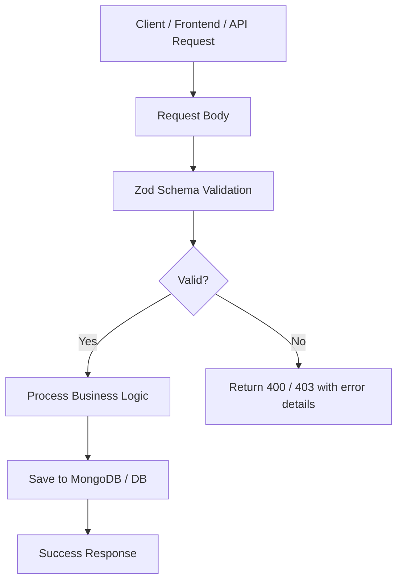
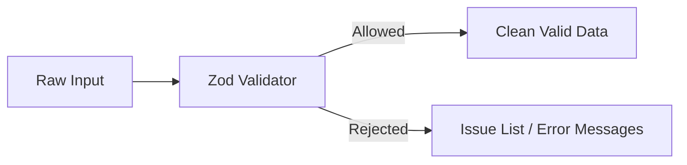

# Zod Learning Repo - Deep Dive in Hinglish

Aaj ka yeh repo ek practical learning journey hai `Zod` ke baare mein — ek schema validation library jo JavaScript/TypeScript projects mein data ko validate, sanitize aur structure karne ke kaam aati hai.

Agar aap backend development, API validation, form handling ya user input safety samajhna chahte ho, toh `Zod` ek must-know tool hai.

Is repo mein hum dekhenge:

- Zod kya hai aur kyun important hai
- JavaScript/TypeScript datatypes ke saath Zod ka connect
- Schema, parse, safeParse, transform, default, union, refinement
- Real-world backend validation examples
- Diagram-based explanations
- Practical project examples like signup validation

---

## 1) Intro: Zod kya hai?

`Zod` ek runtime validation library hai. Matlab, jab aap server se request receive karte ho, ya client se form data aata hai, tab aap ensure karte ho ki data sahi shape mein hai, sahi type ka hai, aur required conditions satisfy kar raha hai.

Agar Zod na ho, toh hum manually checks karte:

```js
if (!email || typeof email !== 'string') {
  throw new Error('Invalid email');
}

if (password.length < 6) {
  throw new Error('Password too short');
}
```

Lekin yeh repetitive aur error-prone hota hai. `Zod` is process ko elegant, readable aur scalable bana deta hai.

### Simple example

```js
import { z } from 'zod';

const userSchema = z.object({
  name: z.string().min(2),
  age: z.number().min(18),
  email: z.string().email(),
});

const result = userSchema.safeParse({
  name: 'Neeraj',
  age: 20,
  email: 'neeraj@example.com'
});

console.log(result);
```

Output:

```js
{
  success: true,
  data: {
    name: 'Neeraj',
    age: 20,
    email: 'neeraj@example.com'
  }
}
```

Agar input galat ho:

```js
const invalid = userSchema.safeParse({
  name: 'N',
  age: 15,
  email: 'invalid-email'
});

console.log(invalid);
```

Output meh error details milenge:

```js
{
  success: false,
  error: {
    issues: [
      { code: 'too_small', path: ['name'], message: 'String must contain at least 2 character(s)' },
      { code: 'too_small', path: ['age'], message: 'Number must be greater than or equal to 18' },
      { code: 'invalid_string', path: ['email'], message: 'Invalid email' }
    ]
  }
}
```

### Why Zod is powerful?

- Runtime validation
- Type inference support (TypeScript)
- Clean error messages
- Works beautifully with Express, Next.js, React, APIs
- Safer than ad-hoc condition checks

---

## 2) Project setup and repo overview

Is repo ka core concept hai signup schema validation. Har user ke liye email, fullName aur password validation define ki gayi hai.

### Validation example from repo

File: `validations/user.validation.js`

```js
import z from "zod";

export const signupSchema = z.object({
    email: z.string().email({message: "Invalid email format"}),
    fullName: z.string().min(8, { message: "Full name must be at least 8 characters long" }),
    password: z.string().min(6, { message: "Password must be at least 6 characters long" })
});
```

Yeh example explain karta hai ki frontend/backend ke request payload ko validate karne ke liye aap schema define karte ho.

### Express route usage

```js
app.post("/signup", async (req, res) => {
  try {
    const { data, success, error } = signupSchema.safeParse(req.body);

    if (!success) {
      return res.status(403).json({
        message: "Invalid Inputs",
        error: error.format()
      });
    }

    const { email, fullName, password } = data;
    // save user in DB
  } catch (error) {
    res.status(500).json({ message: 'Internal server error.' });
  }
});
```

### Why this matters?

Agar user manually `email` ke saath invalid data bhejta hai ya `fullName` too short hota hai, toh server request reject ho jayega before database interaction.

---

## 3) Core concepts of Zod

### 3.1 Schema kya hota hai?

Schema ek rule set hota hai jo batata hai ki data ka structure kaisa hona chahiye.

```js
const schema = z.object({
  id: z.number(),
  name: z.string(),
  isActive: z.boolean()
});
```

Agar data is schema se match nahi karta, toh validation fail.

### 3.2 parse vs safeParse

#### parse()

```js
const result = schema.parse({ id: 1, name: 'A', isActive: true });
```

Agar invalid data hai, toh exception throw kar dega.

#### safeParse()

```js
const result = schema.safeParse({ id: 1, name: 'A', isActive: true });

if (!result.success) {
  console.log(result.error.issues);
} else {
  console.log(result.data);
}
```

Safe parse recommended hota hai because it doesn't crash the app. Server code ke liye yeh best practice hai.

### 3.3 Primitive types

Zod basic data types support karta hai:

```js
const schema = z.object({
  name: z.string(),
  age: z.number(),
  adult: z.boolean(),
  city: z.nullable(z.string()),
  email: z.string().email(),
  tags: z.array(z.string()),
  score: z.number().min(0).max(100),
  role: z.enum(['admin', 'user'])
});
```

### 3.4 Optional, nullable, default

```js
const profileSchema = z.object({
  bio: z.string().optional(),
  phone: z.string().nullable(),
  country: z.string().default('India'),
  username: z.string().default('guest')
});
```

Yeh schemas input ko flexible banate hain bina validation logic ko manual write kiye.

### 3.5 Refinement

Aap custom validation add kar sakte ho:

```js
const passwordSchema = z.string().refine((value) => value.length >= 8, {
  message: 'Password must be at least 8 characters long'
});
```

### 3.6 Transform

Values ko manipulate karna:

```js
const schema = z.object({
  name: z.string().transform((value) => value.trim()),
  age: z.string().transform(Number)
});
```

### 3.7 Union and any

```js
const value = z.union([z.string(), z.number()]);
const anything = z.any();
const unknownData = z.unknown();
```

---

## 4) Datatypes explained in simple terms

Zod ke andar datatypes ka concept asli programming ke data types se closely related hai.

### Primitive datatypes

```js
z.string();
z.number();
z.boolean();
z.bigint();
z.date();
z.undefined();
z.null();
z.literal('admin');
```

### Complex / composite datatypes

```js
z.array(z.string());
z.object({ name: z.string() });
z.enum(['A', 'B']);
z.record(z.string(), z.number());
z.union([z.string(), z.number()]);
z.tuple([z.string(), z.number()]);
```

### Example: real-world object

```js
const orderSchema = z.object({
  orderId: z.string(),
  items: z.array(
    z.object({
      productId: z.string(),
      qty: z.number().min(1)
    })
  ),
  total: z.number().positive(),
  paymentStatus: z.enum(['paid', 'pending', 'failed'])
});
```

### Why data types matter?

Kyunki backend validation mein agar `age` string ke roop mein aata hai aur aap usko number samajh kar operations karte ho, toh bug generate ho sakta hai. Zod data types ko strictly enforce karta hai.

---

## 5) Flow diagram: request se validation tak



### Diagram explanation

Is flow mein sabse important part hai `Zod Schema Validation`. Request body aane ke baad, server validation layer check karta hai ki required fields mil rahe hain ya nahi, type sahi hai, constraints satisfy ho rahe hain ya nahi. Agar validation pass ho jaata hai tabhi DB call proceed hota hai.

This prevents:

- invalid user registration
- malformed payloads
- SQL/DB injection style unsafe data in app logic
- unhandled runtime errors

---

## 6) Zod aur JavaScript/TypeScript mental model

Zod ka core concept hai:

- Data ko define karo
- Rules banao
- Parse / Validate karo
- Error ko handle karo

Aise samjho:

```js
const schema = z.object({
  email: z.string().email()
});
```

Yeh basically ek gate hai jo data ko allow karta hai sirf tab jab sahi form mein ho.

### Mental model



Aapke app ke liye yeh ek safety net ka kaam karta hai.

---

## 7) Deep dive: common patterns

### 7.1 object validation

```js
const userSchema = z.object({
  fullName: z.string().min(3),
  email: z.string().email(),
  password: z.string().min(6)
});
```

### 7.2 nested objects

```js
const addressSchema = z.object({
  city: z.string(),
  pincode: z.string().length(6)
});

const userSchema = z.object({
  name: z.string(),
  address: addressSchema
});
```

### 7.3 arrays

```js
const tagsSchema = z.array(z.string()).min(1);
```

### 7.4 enum validation

```js
const roleSchema = z.enum(['admin', 'user', 'moderator']);
```

### 7.5 optional fields

```js
const schema = z.object({
  name: z.string(),
  nickname: z.string().optional()
});
```

### 7.6 custom messages

```js
const amountSchema = z.number({
  invalid_type_error: 'Amount should be a number',
  required_error: 'Amount is required'
}).min(1, { message: 'Amount must be greater than 0' });
```

---

## 8) Real-life usage in backend

### 8.1 User signup API

```js
const signupSchema = z.object({
  email: z.string().email(),
  password: z.string().min(6),
  fullName: z.string().min(3)
});
```

Server code:

```js
app.post('/signup', (req, res) => {
  const result = signupSchema.safeParse(req.body);

  if (!result.success) {
    return res.status(400).json({ errors: result.error.issues });
  }

  res.status(201).json({ message: 'User created', user: result.data });
});
```

### 8.2 E-commerce product creation

```js
const productSchema = z.object({
  title: z.string().min(3),
  price: z.number().positive(),
  stock: z.number().int().nonnegative(),
  category: z.enum(['books', 'electronics', 'fashion'])
});
```

### 8.3 Payment validation

```js
const paymentSchema = z.object({
  amount: z.number().positive(),
  currency: z.enum(['INR', 'USD', 'EUR']),
  cardNumber: z.string().regex(/^\d{16}$/)
});
```

### 8.4 Form validation in frontend

```js
const loginFormSchema = z.object({
  email: z.string().email(),
  password: z.string().min(8)
});
```

Front-end form submission se pehle validation hoti hai, taaki invalid input server tak nahi jaaye.

---

## 9) Best practices

### ✅ Recommended patterns

- `safeParse()` use karo for API requests
- custom error messages define karo
- nested schemas maintain karo
- `.refine()` and `.transform()` intelligently use karo
- response shape ko schema ke through standardize karo

### ❌ Avoid

- Manual ad-hoc checks everywhere
- Overly complex validation logic in route handlers
- Ignoring error details
- Not validating user input before DB operations

---

## 10) Why Zod is important in modern backend

Aaj ke backend apps mein data validation ek critical layer hoti hai. User input se collection, authentication, payment, profile management, forms sab validate hote hain. Agar validation missing ho, toh:

- invalid records store ho sakte hain
- application logic break ho sakta hai
- security risks badh sakte hain
- debugging difficult hoti hai

Zod aapko ek clear, maintainable aur predictable validation system deta hai.

---

## 11) This repo in one sentence

Yeh repo ek practical learning lab hai jahan hum `Zod` ko backend app ke real-world example ke through samajhte hain — especially signup validation, object schemas, and runtime checking.

---

## 12) Quick start

```bash
npm install
npm run dev
```

Agar `MongoDB` config available hai, toh app run hoga and signup route validation ke saath work karega.

---

## 13) Key takeaway

Zod sirf validation library nahi hai — yeh aapke application ki safety, consistency aur maintainability ko improve karta hai.

Agar aap ek backend developer banna chahte ho, toh Zod ko samajhna ek important milestone hai.

> “Garbage in, garbage out.” Zod ek barrier banta hai jo bad input ko app ke andar entry karne se rokaata hai.

---

## 14) Final thought

Agar aap beginners ho toh shuruat simple schema se karo:

```js
const schema = z.string();
```

Phir gradually object, arrays, enums, nested validations, transforms aur refinement ko explore karo.

Zod ko real projects mein use karna seekho, aur code ko self-documenting banao.

Happy coding! 🚀

---

## 15) Extra mini cheat sheet

```js
z.string()
z.number()
z.boolean()
z.array(z.string())
z.object({ name: z.string() })
z.enum(['a', 'b'])
z.string().email()
z.string().min(5)
z.string().max(20)
z.string().optional()
z.string().nullable()
z.string().default('guest')
z.string().transform((v) => v.trim())
z.string().refine((v) => v.length > 3)
```

Agar aap chaho, toh hum next step mein is repo ko aur strong bana sakte hain:

- `README` ko aur detailed professional style mein rewrite
- Zod ke advanced topics add karna (`superRefine`, `preprocess`, `passthrough`, `strict`, `catch`)
- `MongoDB + Express + Zod` project ka full architecture explanation
- Interview-style Q&A for Zod
